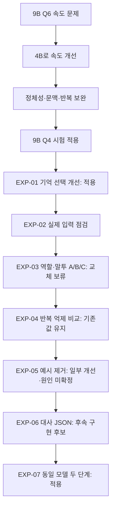

# 대화 품질 실험 계보

목적: 무엇을 확인했고, 왜 다음 실험으로 넘어갔으며, 실제 운영에 무엇이 적용됐는지를 한눈에 추적한다. 2026-09-08부터 이 문서를 누적 갱신한다. 이전 단계는 PROJECT_STATUS와 기존 결과 문서에서 복원한 요약이며 새 실험처럼 재실행하거나 비교 수치를 만들어내지 않는다.

## 이전 단계 — 기존 기록에서 복원

| 단계 | 원인 / 한 일 | 결과와 이어진 판단 | 근거 |
|---|---|---|---|
| 2026-09-07 9B Q6 → 4B Q4 | 응답 지연, GPU/CPU 혼합 → 작은 모델 GPU offload | 속도 개선 후 적용. 부하와 프롬프트도 달라 완전한 동일 조건 A/B는 아님 | [상태 기록의 응답 지연 개선](PROJECT_STATUS.md#11-응답-지연-개선-검증-시작-2026-09-07) |
| 2026-09-08 정체성/문맥/반복 보완 | 이름 설정 명시, 토큰 예산/서버 이력, 빠진 샘플링 값 전달, 짧은 긍정 예시 | 정확한 문자열 반복 감소가 대화 일관성을 보장하지 않아 다음 모델 시험으로 연결 | [상태 기록](PROJECT_STATUS.md), [소형 모델 조사](SMALL_MODEL_DIALOGUE_RESEARCH_2026-09-08.md) |
| 2026-09-08 9B Q4 시험 | 사용자가 더 무거운 Aggressive 모델 시험 요청 | 현재 9B Q4/context4096 사용. 4B rollback 보존, 품질 승자로 확정한 것은 아님 | [상태 기록](PROJECT_STATUS.md) |

## 순차 실험

| ID / 부모 | 가설과 변경 변수 | 검증 / 결과 | 운영 적용 | 왜 다음으로 갔나 |
|---|---|---|---|---|
| EXP-01 / 9B 시험 | 현재 질문+제한된 최근 사용자 문맥으로 관련 기억만 0~3개, 취향 정정 | 합성 검색 집합 12/12. 9B 6개 형식 유효, 역할 혼동 남음. 공개 취향 정정 3턴 성공 | 적용 | 기억 전달이 맞아도 역할/말투가 어긋남 |
| EXP-02 / EXP-01 | 실제 입력의 역할·예시·변환 경로 점검 | 1,347토큰 합성 샘플, 역할/원문 정상. 규칙과 예시 충돌·중복 제목·서버 답변 보정 확인 | 점검만 | 문제 후보를 분리한 프롬프트 실험 필요 |
| EXP-03 / EXP-02 | A현재/B역할 정리/C예시 수정, 모델/설정 고정 | 60+12회 형식 유효. C의 국소 개선은 새 표현에 충분히 일반화되지 않음 | B/C 미적용, A 유지 | 프롬프트를 더 늘리기 전 생성 설정 영향 분리 |
| EXP-04 / EXP-03 | 현재 프롬프트 고정, repeat 단독 낮춤/높임 및 penalty 전체 해제 진단 | 48회 형식 유효. 해제 시 일부 이름 보존 개선, 문맥 실패 지속. 빈 이력 면접 질문에 A/C가 과거 시험 사건 추가 | 기존값 유지 | 고정 예시를 실제 이력으로 혼입하는지 분리할 근거 발견 |
| EXP-05 / EXP-04 | 기존 예시 / 가상 참고임을 명시 / 예시 제거 | 36회 형식 유효. 제거 시 일부 이름/미제공 노력 추측/짧은 확인 개선. 없는 시험 사건은 기존 조건에서도 미재현 | 후속 실험 기준으로 사용, 공개 미변경 | 문맥·구체적 요청 이해가 남아 출력 업무 차이를 다음 비교 |
| EXP-06 / EXP-05 | 예시 없는 입력 고정, 전체 JSON / 대사만 JSON / 대사 텍스트 | 36+12회 형식 유효. 대사 JSON은 일부 직접 답변/이유 회상/이름 복원 개선, 기본 지연 중앙값 3.99→1.14초(부가 정보 제외) | 후속 구현 후보, 공개 미변경 | 부가 정보 처리 비용과 저장 안정성을 포함해야 실제 적용 가능 |
| EXP-07 / EXP-06 | 같은 모델에 대사 JSON → 부가 정보 JSON 순차 요청 | 522 tests, 합성 4사례를 3차 보정(독립 검증 아님), 최종 8호출 형식 유효. 공개 3턴/replay/reset 성공 | 적용, single_pass 복구 가능 | 대사 역할 표현·부가 정보 오분류가 남아 새 표현에서 별도 평가 |

근거 문서: [EXP-01](CONTEXT_AWARE_MEMORY.md), [EXP-02](PROMPT_INPUT_AUDIT.md), [EXP-03](IDENTITY_VOICE_COMPARISON.md), [EXP-04](SAMPLING_COMPARISON.md), [EXP-05/06](EXAMPLE_AND_REPLY_ABLATION.md), [EXP-07](TWO_STAGE_GENERATION.md).

## 기록 규칙

새 실험 시작 전에 ID·부모·가설·변경 변수·고정 조건·판정 기준을 기록한다. 종료 시 원자료/시드/명령·실패·결과·한계·적용 여부·다음 질문을 덧붙인다. 실패하거나 보류한 버전도 삭제하지 않는다. '형식 성공', '검색 성공', '문맥/말투 평가'와 '속도'는 별도로 기록한다. 동일 사례를 반복한 결과를 독립된 대규모 검증처럼 표현하지 않는다. 개인 대화/키/임시 주소는 이 기록에 포함하지 않는다.

## EXP-08 / EXP-07 — 기억 전달 경로 (적용 완료)

가설: 6턴 제한과 사용자 전용 추출이 원문에 있는 이름/캐릭터 추천을 누락한다. 모델/샘플링/두 단계 계약 고정. 변경: 원문 이력, 규칙 기반 기본 정보 및 출처 있는 사건 검색, 입력 우선순위. 합성 장기 대화·정정·출처/소유자 격리·rollback/reset 및 실제 토큰화로 검증한다. 개인 대화는 원자료에 포함하지 않는다.

EXP08 결과: 540 tests, 52/152턴 합성 실제9B 각4사례. 원문 제외 후에도 이름/추천 증거가 남아 회상 성공. 미제공 영화 제목 미생성, 호칭 변경 표현은 어색함. 긴 조건 중앙값14.132초. 기존 문제 대화 재구성 및 공개 이름/호칭3턴/replay/reset 확인. 다음: 다양한 사건 충돌/정정과 비용 평가. [구현/원자료](MEMORY_PIPELINE.md).

## EXP-09 / EXP-08 — 영화 약속의 이력/검색 기억 분리 (계획)

Task17 규칙을 기준으로 합성 영화 추천/시간 제안 후 중립 대화를 만든다. 3조건: 이력 있음+검색 없음, 원문 이력 없음+실제 검색, 원문 이력 없음+기억 없음. 질문은 명시적 영화 회상과 암시적 시간 발언 후 ‘어딜?’; seed109/211, 같은 모델/설정/두 단계 유지. 원문 없음은 통제된 입력 제거이며 자연 토큰 밀림 실험으로 주장하지 않는다. 실제 source_views 검색을 사용하고 수동으로 정답 기억을 넣지 않는다. 원자료는 docs/evaluation/memory-ablation-v1.json, 사용자DB 접근/쓰기 없이 순차 모델 호출. 형식·검색·답변·지연 분리, 채택 변경 없음.

EXP09 완료:12회/24모델 호출 형식 정상. 명시적 영화 회상은 검색만으로2/2 대상 회상(제목 철자 완전일치1/2), 암시적 어딜은 검색0개로2/2 집 제안, 이력만이면2/2 영화관. 채택 변경 없음. [결과/한계](MEMORY_ABLATION.md), [원자료](evaluation/memory-ablation-v1.json).

## EXP-10 / EXP-09 — 동일 metadata 호출에서 다음 턴 검색 단서 (계획)

호출 추가 없이 부가정보 스키마에 원문 근거를 가진 단서 최대2개를 실험적으로 추가한다. 기존 운영 기본값은 그대로. 다음 한 턴의 명시적 짧은 생략 질문에서만 검색 질의 확장. 이름/활동 특정 이벤트를 추출 규칙으로 추가하지 않고 모델이 대상을 제안하며 서버는 실제 입력 원문 존재를 검증한다. 생략 감지 자체는 제한된 보수적 규칙으로, 일반 의도 해석이 완성됐다고 주장하지 않는다. 영화/책/음식 취향 및 화제전환/근거없음 사례, seed109/211 비교. 같은9B/4096/256토큰/샘플링 유지. 입력 근거·검색·대사·metadata형식·지연 분리. 실제 사용자DB 접근 없음.

EXP10 추가 계획: 최초5범주 비교 후 별도 timed 사례(8시 영화 약속→벌써8시→어딜)도 동일2seed/2조건으로 확인한다. 원자료 search-cues-timed-v1.json. 초기 harness JSON 직렬화 오류로 baseline1건 후 중단되어 직렬화 수정 후 재시작; 중단 출력은 당시 도구로그에 보존, 결과 집계에는 포함하지 않는다.

EXP10 완료/채택보류:24개2턴실험96모델호출. 원문제거후 근거있는4종8건회상0/8→4/8(책2,취향1,시간1),영화제목사례누락. 주5범주첫턴중앙값2.781→2.922s. 주제잔류/무의미단서발견. 운영OFF유지. [상세](SEARCH_CUE_EXPERIMENT.md), [주실험](evaluation/search-cues-v1.json), [시간사례](evaluation/search-cues-timed-v1.json).

## EXP-11 / EXP-10 — 검색단서 누락·잔류 검증 (계획)

기존 EXP10 코드를 고정하고 unseen 표현의 영화/책 후속 질문, 화제전환 뒤 생략 질문, 명시적 취소 뒤 목적지 질문을 baseline/단서ON으로2seed 비교한다. 4사례×2조건×2seed,각2턴. 모델/프롬프트/한도/검색규칙 수정 없음. 긍정은 정확한 제목 회상, 화제전환은 이전영화 검색/출력혼입, 취소는 취소한일정을현행으로단정하는지 따로 판정. 검색됨이곧취소무시를뜻하지않음. 현재단서의정책채택은이번결과까지보고판정. 사용자DB 미접근,운영OFF. 원자료 docs/evaluation/search-cues-validation-v1.json.

EXP11 완료/보류 유지:16실행32턴64호출, 예외·재시도 없음. 영화 양쪽0/2, 책 양쪽2/2, 모든 대응 쌍의 최종 답변 동일. 화제 종료 문장의 영화 키워드로 기존 검색도 과거 영화 선택; ON은 오래된 영화 단서도 유지. 취소한 약속을 현행으로 답하지 않았으나 DB 취소 처리 검증은 아님. 첫 턴 단계시간 합 중앙값 OFF3.2025/ON2.9220초, 순서 고정 소표본으로 속도 개선 주장 불가. 다음 질문: 현재 화제 관련성과 단서 폐기 기준. [상세/명령/한계](SEARCH_CUE_VALIDATION.md), [원자료](evaluation/search-cues-validation-v1.json).

## EXP-12 / EXP-11 — 활성 화제 기반 규칙 검색 (계획)

가설: 생략 질문에서 최근 사용자 발화의 화제 종료·전환·취소 전 내용을 폐기하고, 작품/추천/선택 지칭을 가장 최근의 출처 있는 추천 하나에 연결하면 영화 누락과 이전 화제 검색을 함께 줄일 수 있다. 기존 DB/프롬프트/9B/4096/256/두 단계/샘플링 고정. 새 호출·embedding·스키마 없음. EXP11의4사례×seed109/211을 수정된 규칙으로 재실행하고 변경 전 EXP11 OFF와 비교한다. 긍정은 제목 회상, 화제전환은 이전영화 기억 미선택/출력 미혼입, 취소는 취소 약속을 현행으로 단정하지 않는지 분리 판정. 사용자DB 미접근. search_cues 운영OFF 유지. 원자료는 docs/evaluation/active-topic-retrieval-v1.json. Task19.

EXP12 완료/규칙 적용: 변경 후8실행16턴32호출, 오류·재시도0. 영화 대상 검색0/2→2/2, 종료된 영화 오선택2/2→0/2, 책2/2유지, 취소0개 유지. 영화 제목 대사 사용은1/2라 검색 성공과 생성 활용의 간극이 남음. 첫턴 단계합 중앙값2.7495초, 비교 시점이 달라 속도 우열 주장 안 함. 초기 단위검증1실패(취소 뒤 새 제안)를 수정 후 통과. 모델 search_cues는 계속OFF. [상세](ACTIVE_TOPIC_RETRIEVAL.md), [원자료](evaluation/active-topic-retrieval-v1.json).

## EXP-13 / EXP-12 — 답변 알맹이·반복 루프 차단 (계획)

가설: 현재 입력별 최소 답변 형태, 반복 assistant 이력 축약, 최근 대사와 근접한 후보의 조건부1회 재생성이 짧은 맞장구 수렴을 줄인다. 모델/9B/4096/256/80자/schema/두 단계/샘플링/DB 고정. 질문·제안·감정·일반 대화·짧은 확인과 합성 반복 이력을 기존/개선으로 비교한다. 형식, 구체적 답변, 반복, 조건부 추가 호출, 전체 지연을 분리한다. 실제 사용자 원문은 결과 파일에 넣지 않고 관찰 집계만 기록한다. 운영 반영 전 단위/실제 모델 결과 확인. Task20.

EXP13 1차 전면지침 채택거부:7사례×2조건×2seed=28턴/56호출, 형식오류·재시도0. 활동 제안은 구체화됐으나 개방질문 개선1/2, 감정형에 근거없는 합격 낙관, 의견형에 불필요한 질문/단정, 경계형2/2 명확한 거부 실패 및 한 번 반대 방향 대사. 합성 반복 이력은 baseline도 반복 미재현, 조건부 재생성0회. ON 총시간 중앙값9.273s/OFF7.148s이나 순차 소표본으로 고유비용 단정 안 함. 전면 동적 지침과 경계 문구는 운영에서 제거. 원자료 docs/evaluation/reply-quality-v1.json 보존.

## EXP-14 / EXP-13 — 실제 반복 이력의 최소 개입 검증 (계획)

전면 지침 없이 대사 입력에서 최근 유사 assistant 군집의 중간 pair만 축약하고, 새 후보가 최근6개 중 유사 답변2개 이상과 겹칠 때만 한 번 재생성한다. metadata는 최종 후보와 원래 committed history를 사용. 실제 최근 반복 이력은 읽기 전용으로 마지막 committed user 턴을 재구성해 baseline/최소개입, seed109/211 비교하되 사용자 원문·출력을 결과 파일에 저장하지 않고 이력 수/축약 수/반복 점수/호출 수/채택 판정만 기록한다. DB 쓰기·공개 quota 사용 없음. 일반 합성 단위 검증과 전체 회귀 후 운영 적용 판정.

EXP14 완료/최소개입 적용: 실제 74메시지 입력에서 반복 pair 5개를 대사 입력에서만 생략했다. seed109는 최근 답변 최대 유사도1.000·유사4개→0.400·0개, seed211은0.714·2개→0.400·0개였다. 두 조건 모두 기본 reply+metadata 2호출로 끝나 조건부 추가 호출은 없었다. DB/공개 quota/원문 저장 없음. 전면 구체화 프롬프트는 EXP13 결과대로 폐기하고 반복 이력 축약과 반복 후보 1회 재생성만 기본 적용한다. 일반적인 단답 깊이는 미해결. [상세](REPLY_LOOP_GUARD.md).

## EXP-15 / EXP-14 — 답변 계획 구조 비교 (계획)

현재 9B/캐릭터/샘플링/4096/256/80자/thinking OFF를 고정하고 reply 단계만 비교한다. A는 현재 reply-only 1회, B는 짧은 응답 목표·입력 근거·피할 추측과 reply를 같은 JSON 1회에 출력, C는 계획 JSON 후 reply JSON의 순차 2회다. 7개 합성 사례×seed109/211, 총42결정/56호출. metadata·DB·공개 요청 제외. 직접성·구체성·근거 사용·근거 없는 단정·맞장구/되묻기 종결·캐릭터·지연을 분리하고 원문을 함께 검토한다. B가 안정적으로 개선되면 동일 호출 수 후보, C는 B보다 명확한 이득이 있을 때만 추가 호출 후보. Task21.

EXP15 완료/모두 미채택:42결정/56호출, parse·transport 실패0. 보정한 자동 보조지표의 구체적 표현은 direct11/14, scaffold11/14, sequential10/14; reply 중앙 길이16/21.5/21자, reply 단계 중앙값0.875/1.453/3.133초. scaffold는 주체 역전과 경계 반대 방향 대사, sequential은 근거 없는 관계 단정과 경계 실패가 발생했다. 긴 답이 곧 알맹이 있는 답은 아니므로 두 계획 조건 모두 운영 미적용. 원자료 docs/evaluation/reply-planning-v1.json.

## EXP-16 / EXP-15 — 설치된 4B rollback 모델 교차 비교 (계획)

새 모델 다운로드 없이 기존 4B Aggressive Q4_K_M를 9B direct 기준과 같은 7사례×seed109/211, reply-only 14호출로 비교한다. 캐릭터/4096/256/80자/샘플링/thinking OFF 고정. 실제 웹·DB·공개 요청은 사용하지 않으며 테스트 후 현재 9B 런타임을 복구한다. 형식·구체성·역할/주체·근거 없는 단정·경계·지연을 분리한다. 4B가 품질 후보가 아니면 운영 모델은 유지하고 다음 비교는 새로운 대화용 모델을 별도 승인/다운로드한 뒤 진행한다. Task21.

EXP16 완료/미채택:4B direct 14/14 형식 성공, parse·transport 실패0, reply 중앙0.617초·23자·키워드12/14. 9B direct의0.875초·16자·11/14보다 표면 지표는 좋았으나 경계2건의 행동 주체 역전, 면접 원인과 수면 신체 증상 추측이 발생했다. 4B는 속도 rollback으로만 유지하고 품질 후보에서 제외했다. 9B·웹·관리자·터널을 복구했고 web/admin/model/public root 200을 확인했다. [상세](REPLY_PLANNING_COMPARISON.md), [원자료](evaluation/reply-model-4b-v1.json).

## EXP-17 / EXP-14 — 문맥 정보 보존 회귀 수정 (계획)

가설: 반복 답변 축약에서 고유 사용자 발화를 보호하고, 취소 사건을 부정·인용·대상별로 판정하며, 결정적 취향 인용을 순수 회상에만 제한하면 호출 수와 기존 구조를 바꾸지 않고 정보 손실을 줄일 수 있다. 모델/9B/4096/256/두 단계/샘플링/DB/API 계약은 고정한다. 외부 검토 자료의 3개 P0 합성 probe를 현재 코드의 실패 테스트로 재현한 뒤 단계별 최소 수정과 기존 회귀를 확인한다. 실제 사용자 DB와 공개 quota는 사용하지 않는다. 형식 성공·기억 검색·대사 생성 품질·지연을 혼합해 주장하지 않는다. Task24.

EXP17 완료/적용: 수정 전 관련62 tests 통과 뒤 새 probe에서 사용자 정정 손실1건, 취소 의미·대상2건, 복합 회상 교체1건이 예상대로 실패했다. 사용자 발화가 단순 확인/중복일 때만 반복 pair를 축약하고, 취소 부정·의문·인용 제외 및 표지/source turn 연결, 순수 회상만 결정적 인용하도록 수정했다. 새 회귀5건 포함 관련67 tests와 전체596 tests 통과. 모델 호출·schema·API 변경 없음. 실제 서버 model/web/admin/public 정상, 사용자DB·quota 미사용. 일반 fact 주체 검증과 긴 evidence 예산은 후속 대상. [상세](CONTEXT_INTEGRITY_FIXES.md).

## EXP-18 / EXP-17 — 기억 주체·문맥 최소 영역 (계획)

가설: fact 원문에서 명시적 주체가 빠진 후보를 거부하고, 최신 대화 1쌍을 일반 기억보다 우선하며, 긴 source-backed evidence를 항목 단위로 제거하면 호출·DB·API 변경 없이 잘못된 귀속과 불필요한 입력 초과를 줄일 수 있다. 현재 9B/4096/256/두 단계/샘플링/최종 tokenizer 검증은 고정한다. 외부 검토의 주체 손실·마지막 pair 축출·긴 evidence 초과 조건을 합성 실패 테스트로 먼저 재현한다. 실제 사용자 DB와 공개 quota는 사용하지 않는다. 검색 성공과 모델 답변 활용은 별도로 본다. Task25.

EXP18 완료/적용: 수정 전 관련54 tests를 기준선으로 두고 주체 생략 수용, 일반 기억의 직전 pair 우선, 긴 evidence의 입력 초과 3건을 실패로 재현했다. 첫 예산 수정은 최근 이력 제거 뒤 음수 분기가 반복되는 오류를 500턴 회귀에서 발견해 수정했다. 최종 관련110 tests·전체599 tests 통과. 실제 llama.cpp 3776 입력 예산에서 75 tokens, 직전 pair 보존, 긴 evidence 제거 확인. 사용자DB·공개 quota·생성 호출은 사용하지 않았으며 대사 품질/지연 개선을 주장하지 않는다. [상세](MEMORY_SUBJECT_AND_BUDGET.md).
