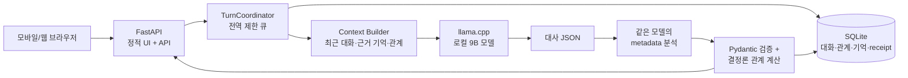
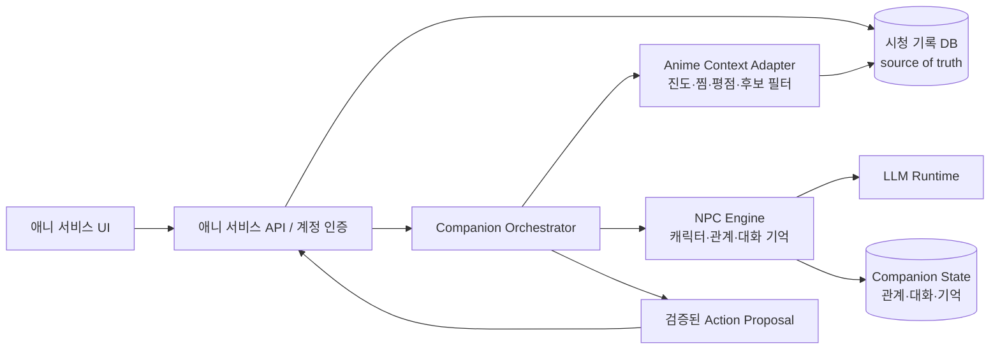

# GPT Pro 검토 브리프 — NPC Chat × 애니 시청 기록 서비스

검토 기준일: **2026-09-23 (KST)**  
작성 시작 기준: **`Newrred/npc-chat` `main@96746a0`**  
최신 저장소: **<https://github.com/Newrred/npc-chat>**  
이 문서의 최신 링크: **<https://github.com/Newrred/npc-chat/blob/main/docs/GPT_PRO_ANIME_INTEGRATION_BRIEF.md>**

## 1. 논의 목적

현재 프로젝트는 유이·띳띠와 대화하면서 표정, 관계 수치, 장기 기억이 누적되는 로컬 우선 캐릭터 챗봇이다. 다음 제품 단계로 이 기능을 애니 시청 기록 서비스에 결합하는 방안을 검토한다.

검토의 핵심은 “현재 화면을 애니 서비스에 붙일 수 있는가”보다 다음 세 가지다.

1. 시청 기록과 대화 기억 중 어느 시스템이 어떤 사실의 기준이 되는가?
2. 3060 Ti 한 대와 9B 로컬 모델의 속도·동시성 한계 안에서 어떤 경험부터 제공할 것인가?
3. 캐릭터성과 관계 누적이라는 강점을 유지하면서 추천·기록 변경·스포일러를 어떻게 안전하게 다룰 것인가?

`docs/handoff-package/`는 2026-09-03의 역사적 스냅샷이다. 현재 구현 판단에는 이 문서, `PROJECT_STATUS.md` 상단과 실제 코드를 우선한다.

## 2. 현재 제품과 구현 범위

현재 사용자는 모바일 중심의 메신저 UI에서 캐릭터를 골라 짧은 한국어 대화를 한다.

- 캐릭터: 유이(`default`), 띳띠(`cartethyia` 내부 호환 ID)
- 화면: 정적 HTML/CSS/JavaScript, 채팅 목록·대화방·입력 중 표시·표정 화면
- 앱: FastAPI 한 프로세스가 프런트 정적 파일과 `/api`를 같은 origin에서 제공
- 모델: 별도 OpenAI-compatible llama.cpp 프로세스
- 저장: SQLite에 프로필·세션·턴·관계·기억·중복 요청 결과 저장
- 관계: `affection`, `trust`, `comfort`, `interest`, `irritation` 5개 수치
- 표정: 캐릭터별 정적 이미지가 기본, ComfyUI는 선택 기능이며 기본 OFF
- 원격 시험: 가입 없는 signed guest cookie, 서버측 활동 인원·요청·일일 한도
- 개발 도구: loopback 전용 검사창에서 실제 입력·출력·기억 선택/저장·프롬프트 시험 확인

브라우저가 보낸 대화 이력, 관계값과 기억은 신뢰하지 않는다. 서버가 SQLite의 확정 상태를 읽어 모델 입력을 만들고, 성공한 결과만 원자적으로 저장한다.

## 3. 현재 실행 구조



기본 배포 단위는 FastAPI 웹앱 하나와 모델 프로세스 하나다. SQLite는 별도 서버가 아닌 로컬 파일이다. 앱은 한 인스턴스·worker 하나, 모델 생성은 한 슬롯으로 운영한다. llama.cpp 포트는 인터넷에 공개하지 않는다.

현재 시험 프로파일은 Intel i7-11700, RAM 약 32 GB, RTX 3060 Ti 8 GB에서 Qwen3.5 9B Aggressive 계열 Q4_K_M, context 4096, 출력 256, parallel 1, thinking OFF다. 빠른 4B 프로파일은 rollback 선택지로 보존한다. 현재 서버 프로세스들은 문서 작성 시점에 중지되어 있다.

## 4. 한 번의 채팅 요청이 처리되는 순서

1. 브라우저가 `session_id`, `profile_id`, `client_turn_id`, `character_id`, 메시지를 전송한다.
2. 원격 모드에서는 signed guest cookie의 소유권, Host·Origin·JSON·본문 크기·분당 한도와 동시 요청을 검증한다.
3. 같은 `client_turn_id`와 같은 payload의 완료 결과가 있으면 모델을 다시 부르지 않고 저장된 응답을 반환한다. 같은 ID에 다른 payload는 409다.
4. 프로필·캐릭터 단위의 확정 대화, 관계, flags, 요약과 장기 기억을 SQLite에서 읽는다.
5. 현재 메시지와 최근 문맥을 이용해 관련 기억을 보수적으로 선택한다.
6. 실제 llama.cpp tokenizer로 출력 여유를 제외한 문맥 길이를 확인한다. 현재 사용자 입력은 몰래 자르지 않는다.
7. 첫 번째 모델 호출은 사용자에게 보여 줄 짧은 `reply`만 생성한다.
8. 같은 모델의 두 번째 호출은 고정된 reply를 바꾸지 않고 표정·감정 태그·interaction·flags·기억 후보를 분석한다.
9. Pydantic schema와 허용 enum을 검증한다. metadata 재시도가 필요해도 성공한 reply를 재생성하지 않는다.
10. 모델은 interaction을 분류하고 서버의 결정론 규칙이 관계 delta를 계산한다.
11. 대화·결정 결과·관계·기억·중복 처리 receipt를 한 트랜잭션으로 commit한다.
12. 응답과 캐릭터 표정을 브라우저에 표시한다.

화면에는 두 단계가 모두 끝난 뒤 응답한다. 현재 early streaming은 없다.

## 5. 기억과 상태의 실제 구조

### 5.1 SQLite에 저장되는 상태

- `profiles`: 로컬/guest 사용자의 내부 프로필
- `sessions`: 프로필과 캐릭터를 잇는 세션
- `character_relationships`: 5개 관계값, flags, 요약, 최근 prompt용 history, version, turn count
- `turns`: 사용자 원문, 모델 decision, 응답, payload hash, `client_turn_id`
- `memories`: 종류·내용·중요도·신뢰도·근거 turn을 가진 최대 50개 기억

전체 turn은 사용자 삭제 전까지 남고, prompt에는 토큰 예산에 들어오는 최근 확정 대화만 전달한다. 요약은 최대 400자다. 대화방 나가기는 해당 프로필·캐릭터의 세션·턴·기억을 지우고 관계를 초기화하지만 별도 usage DB와 기존 백업까지 안전 삭제하는 기능은 아니다.

### 5.2 기억의 세 층

1. **최근 대화**: 바로 앞 문맥을 이해하기 위한 확정된 user/assistant turn
2. **source-backed view**: 이름·선호 호칭, 누가 추천했는지, 제안·약속·취소처럼 원문과 화자가 있는 파생 정보
3. **장기 memory candidate**: 사용자가 직접 밝힌 지속적 사실·취향 중 서버 검증을 통과한 항목

이름과 명시적인 추천·약속 회상은 개선됐지만, 다양한 간접 표현과 복잡한 장기 사건 연결을 모두 해결한 것은 아니다. 현재 검색은 설명 가능하고 빠른 규칙 중심이다.

## 6. 최근 검증 결과

- Python 테스트 **629개**, 프런트·검사창 테스트 **29개** 통과
- 실제 사용자 대화를 포함하지 않은 합성 대화 48개를 development/holdout 24개씩 분리
- development 기준 이름, 저장 기억, 긴 대화 뒤 장소, 기억 부재 처리는 대체로 작동
- 추천 이유의 구체성, 취향 의미 보존, 일부 중국어 혼입, 경계 응답과 말투는 계속 개선 대상
- metadata 문맥을 줄이는 실험은 일반적인 속도 이득이 없고 interaction 분류가 나빠져 미채택; `full` 유지
- tokenizer HTTP 연결 재사용으로 모델 입력 준비 p50은 0.578초에서 0.297초로 감소
- 모델 생성 변동이 더 커서 전체 응답 시간이 항상 개선됐다고 볼 수 없음
- 모바일에서 답변 도착 시 키보드가 자동으로 다시 열리던 동작 수정

현재 계측은 대화 원문·답변·사용자 ID를 남기지 않고 queue, 기억 검색, reply/metadata 준비·추론, token, retry, commit과 전체 시간을 기록할 수 있다. 로컬 상세 inspector는 별도이며 공개 앱에 노출하지 않는다.

## 7. 확인된 강점

### 7.1 애니 서비스에 재사용하기 좋은 부분

- **서버 권위 구조**: 브라우저가 만들어 낸 기록이나 점수를 믿지 않아 시청 기록 서비스와 결합하기 좋다.
- **idempotency**: 네트워크 재시도에도 같은 turn이 두 번 저장되거나 관계가 두 번 바뀌지 않는다.
- **원자적 commit**: 모델 실패 시 대화·관계·기억이 부분 저장되지 않는다.
- **캐릭터 분리**: 설정·말투·관계 matrix·표정 asset을 JSON과 디렉터리 단위로 추가할 수 있다.
- **source-backed memory**: “누가 무엇을 추천했다” 같은 사건을 모델의 막연한 요약과 구분한다.
- **구조화 출력 검증**: 대사와 metadata를 Pydantic으로 검사하고 허용되지 않은 flag를 서버에서 제거한다.
- **관계 계산의 결정성**: 모델이 점수 총계를 직접 쓰지 않고 서버 규칙이 bounded delta를 계산한다.
- **운영 가시성**: 원문 없는 단계별 metrics와 개발용 inspector가 분리되어 있다.
- **로컬 비용**: 모델 API 사용료 없이 기존 GPU에서 시험할 수 있고 모델 프로세스를 교체할 수 있다.
- **점진적 변경에 적합**: 프런트, API, 생성, 관계, 기억과 repository 책임이 나뉘어 있다.

### 7.2 제품적으로 의미 있는 강점

일반적인 추천 챗봇보다 “같이 본 것을 기억하는 캐릭터”에 가까운 경험을 만들 수 있다. 사용자의 시청 이력에 캐릭터 말투, 표정, 관계 누적을 결합하면 다음과 같은 반복 방문 동기가 생긴다.

- 방금 본 화차에 대한 스포일러 없는 감상 대화
- 이번 주 시청 기록을 캐릭터와 함께 돌아보기
- 찜 목록에서 지금 기분에 맞는 한 작품 고르기
- 특정 작품을 끝냈을 때 캐릭터의 축하·반응
- 과거 추천을 실제 시청 기록과 연결해 후속 대화

## 8. 확인된 단점과 위험

### 8.1 모델과 대화 품질

- 9B 모델은 복잡한 질문에서 구체적인 내용보다 짧은 맞장구로 흐를 수 있다.
- 같은 모델을 두 번 순차 호출해 형식과 역할은 안정됐지만 지연이 늘어난다.
- 캐릭터 대화 평가가 아직 합성 세트와 소규모 실사용 중심이다. 독립적인 사람 평가가 부족하다.
- 인터넷 검색, 애니 카탈로그 조회와 안전한 tool execution은 현재 생성 경로에 없다.
- 모델이 작품의 실제 줄거리·성우·방영 정보 등을 아는 척할 수 있다.

### 8.2 기억과 도메인 데이터

- 현재 규칙 검색은 한국어의 일부 이름·취향·추천·약속 문형에 특화되어 있다.
- 시청 진도, 평점, 보류·완료 상태 같은 구조화 기록을 일반 대화 memory로 저장하면 쉽게 낡거나 충돌한다.
- memory 내용은 source turn을 갖지만 외부 애니 엔티티 ID와 버전 계약은 아직 없다.
- `history`와 요약은 캐릭터 대화용이며 수천 건의 시청 기록 검색 엔진이 아니다.

### 8.3 운영과 확장

- 앱 worker 1개, 모델 추론 슬롯 1개다. 여러 사용자가 동시에 요청하면 대기 시간이 직렬로 늘어난다.
- SQLite와 in-process queue/lock은 현재 한 PC·한 앱 인스턴스 전제다.
- guest cookie는 브라우저 단위라 계정 기반 시청 기록의 여러 기기 동기화에 맞지 않는다.
- Quick Tunnel은 임시 시험용이다. 고정 주소·자동 복구·두 DB 백업/복원·부하 시험이 남아 있다.
- 메인 PC가 꺼지거나 게임/작업에 GPU를 쓰면 서비스가 중단되거나 느려진다.

### 8.4 제품·정책

- 스포일러 경계는 프롬프트 권고만으로 보장할 수 없다.
- 사용자가 “3화 봤다”고 말하는 것과 실제 시청 기록의 완료 상태를 구분해야 한다.
- 캐릭터 이미지·설정, 애니 metadata·포스터·줄거리의 이용 권한을 별도로 정리해야 한다.
- 대화와 취향·시청 기록을 함께 처리하므로 개인정보 고지·보관·삭제 범위가 더 명확해야 한다.

## 9. 통합할 때 지켜야 할 핵심 경계

### 9.1 애니 서비스가 사실의 기준

다음 정보는 NPC memory가 아니라 애니 시청 기록 DB/API가 source of truth여야 한다.

- 작품의 canonical ID와 제목
- 사용자의 시청 상태, 마지막 시청 화차와 완료 시각
- 평점, 찜·보류·중단 상태
- 사용자별 스포일러 허용 상한
- 작품 metadata와 서비스에서 검증한 추천 후보

챗봇은 이 정보를 읽어 말투와 반응을 만들 수 있지만 자기 memory의 오래된 문장으로 덮어쓰면 안 된다. 대화 memory에는 “이 작품을 좋아한다고 말했다” 같은 정서적 맥락과 `anime_id` 참조만 보존하고, 현재 시청 상태는 다음 요청에 다시 조회한다.

### 9.2 모델은 기록을 직접 변경하지 않음

“5화까지 본 것으로 기록해 줘” 같은 요청은 다음 순서가 안전하다.

```text
사용자 발화
  -> 모델/결정 규칙이 action proposal 생성
  -> 서버가 anime_id·episode·현재 version·권한 검증
  -> 사용자에게 변경 내용 확인
  -> 애니 서비스가 idempotency key와 함께 commit
  -> commit된 결과를 읽어 캐릭터가 확인 대사 생성
```

모델이 `watched=true`를 출력했다는 이유만으로 DB를 바꾸지 않는다. 읽기 요청과 쓰기 요청의 schema·권한·감사를 분리한다.

### 9.3 스포일러는 서버에서 제한

프롬프트에 “스포일러하지 마”만 적는 것으로 부족하다.

- 사용자별 `max_watched_episode`보다 뒤의 synopsis·character state·episode title을 context 후보에서 제외
- 추천과 작품 설명 데이터도 spoiler level을 갖게 함
- 모델 입력 전에 서버가 자료를 필터링
- 사용자가 명시적으로 범위를 넓힐 때 별도 확인
- 평가 세트에 미시청 작품, 부분 시청, 재시청과 극장판 순서 사례 포함

### 9.4 외부 데이터는 지시가 아닌 자료

작품 소개, 리뷰, 사용자 메모와 외부 API 문장은 prompt injection이 가능한 비신뢰 데이터다. system/character rule과 분리된 data block으로 넣고, HTML·명령형 문구를 정규화하며 action 권한을 부여하지 않는다.

## 10. 가능한 통합 방식

| 방식 | 설명 | 장점 | 단점 | 판단 |
|---|---|---|---|---|
| A. 링크/iframe 연결 | 기존 NPC Chat을 별도 페이지로 열고 애니 서비스에서 링크 | 가장 빠름, 기존 코드 변경 적음 | 계정·시청 기록 연결이 약함, UX와 소유권 분리 | UI 데모에만 적합 |
| B. 같은 백엔드의 모듈로 통합 | 애니 서비스 API 안에 companion orchestration을 모듈로 두고 기존 엔진 재사용 | 계정·transaction·권한·기록 조회가 단순, 개발 중 관리 쉬움 | 기존 앱과 언어/스택이 다르면 이식 비용 | **초기 권장** |
| C. 내부 companion 서비스 | 기존 FastAPI를 private API로 두고 애니 백엔드가 계정/시청 context를 전달 | 독립 배포와 모델 교체 쉬움, 경계 명확 | service auth, 분산 transaction, 장애·관측 복잡 | 사용량/팀 분리 후 적합 |

현재 애니 서비스의 기술 스택이 Python/FastAPI와 가깝고 아직 개발 중이라면 B가 가장 단순하다. 다른 언어·이미 운영 중인 서비스라면 C를 선택하되, 브라우저가 companion 서비스에 직접 시청 기록을 전달하지 않고 애니 백엔드가 인증된 내부 호출을 해야 한다.

## 11. 권장 목표 구조



애니 서비스와 NPC state가 같은 PostgreSQL을 쓰더라도 테이블 책임은 분리한다. 초기 로컬 MVP에서는 기존 SQLite companion DB와 애니 개발 DB를 각각 유지하고 adapter로 읽어도 된다. 중요한 것은 하나의 DB 파일 여부가 아니라 **어느 계층이 어떤 사실을 소유하는지**다.

## 12. 권장 API/문맥 계약 초안

브라우저 입력은 최소화한다.

```json
{
  "conversation_id": "server-issued-id",
  "client_turn_id": "uuid",
  "character_id": "default",
  "message": "오늘 뭐 볼까?"
}
```

서버가 계정에서 다음과 같은 검증된 context를 내부적으로 만든다.

```json
{
  "viewer": {
    "recently_watched": [{"anime_id": "a123", "episode": 4, "watched_at": "..."}],
    "plan_to_watch": [{"anime_id": "a900"}],
    "preferences": [{"tag": "mystery", "weight": 0.8}]
  },
  "candidates": [
    {"anime_id": "a900", "title": "...", "spoiler_safe_summary": "...", "reason_codes": ["plan_to_watch", "short_runtime"]}
  ],
  "spoiler_boundary": {"a123": 4}
}
```

응답에는 사용자에게 보일 대사와 UI가 해석할 구조를 나눈다.

```json
{
  "reply": "오늘은 이 작품 1화부터 같이 볼래? 네 찜 목록 중에서 가장 가볍게 시작하기 좋아.",
  "expression": {"face": "happy", "tags": ["기대"]},
  "recommendations": [{"anime_id": "a900", "reason_codes": ["plan_to_watch", "short_runtime"]}],
  "proposed_actions": [],
  "relationship": {"stage": "getting_acquainted"}
}
```

작품 제목과 추천 후보 선택은 가능하면 서버가 검증한 ID 집합 안에서만 허용한다. 모델은 자연어 이유와 캐릭터 반응을 만드는 역할에 집중한다.

## 13. 재사용·수정·신규 구현 구분

### 그대로 재사용 가능

- 캐릭터 JSON, 말투·표정·관계 matrix
- `DecisionService`의 reply/metadata 분리 원칙
- Pydantic 출력 검증과 오류 계약
- `client_turn_id` 기반 replay/idempotency
- 관계 계산 엔진과 bounded score
- 대화·캐릭터별 기억/turn repository 개념
- TurnCoordinator의 단일 GPU 큐 시작점
- 비개인 metrics, inspector와 합성 평가 방식

### 일반화해서 수정

- `profile_id`를 애니 서비스의 인증된 `account_id`와 연결
- `Context Builder`에 anime context provider 인터페이스 추가
- recommendation/promise 중심의 현재 source view를 anime entity reference까지 확장
- response schema에 검증된 recommendation과 action proposal 추가
- SQLite repository를 기존 서비스 DB 또는 별도 schema에 맞게 adapter화
- 캐릭터별 대화 UI를 애니 작품·시청 기록 화면의 진입점과 연결

### 새로 필요

- 애니 catalog/watch record API 또는 repository adapter
- account authorization과 여러 기기 동기화
- spoiler-safe retrieval/filter
- 작품 ID·episode·version을 가진 action proposal 및 확인 UI
- 시청 기록 쓰기의 idempotency와 audit log
- 애니 도메인용 평가 세트와 추천 품질 지표
- 운영 환경의 고정 배포, 자동 복구, 백업·삭제 정책

## 14. 권장 단계별 MVP

### 단계 0 — 계약과 평가 자료

- 애니 서비스의 account/anime/watch record 식별자와 상태 모델 확정
- 읽기 전용 `AnimeContextProvider` 인터페이스 정의
- 스포일러 정책과 20~40개 합성 대화 평가 세트 작성
- 현재 NPC Chat과 애니 데이터의 source-of-truth 표 작성

완료 기준: 모델 호출 없이도 “이 사용자에게 어떤 자료까지 보여 줄 수 있는가”를 결정론적으로 계산한다.

### 단계 1 — 읽기 전용 companion

- 최근 시청·찜 목록·평점·선호 태그를 서버가 context로 선택
- 캐릭터가 감상 대화, 주간 회고와 후보 1~3개 추천
- 시청 기록 변경은 하지 않음
- 추천은 서버가 제공한 anime ID만 반환

완료 기준: 허구 작품 추천, 미시청 구간 스포일러, 다른 사용자의 기록 혼입이 자동 테스트에서 0건이다.

### 단계 2 — 확인형 기록 변경

- “다음 화 시청 완료”, “찜 추가” 같은 action proposal
- 사용자 확인 뒤 애니 서비스가 commit
- 재시도·중복·취소·버전 충돌 검증
- commit 결과를 다시 읽어 캐릭터 확인 대사 생성

완료 기준: 모델 실패·브라우저 재전송·동시 탭에서도 중복 변경과 거짓 완료가 없다.

### 단계 3 — 제한된 베타

- 계정 기반 여러 기기 연속성
- 고정 주소, 자동 복구, 두 저장 영역 백업·삭제
- 1→2→3→5명 burst와 100턴 연속 시험
- queue p95, 모델 오류율, 추천 클릭/시청 전환과 사람 평가 수집

확장 결정은 이 측정 뒤에 한다. vLLM, PostgreSQL, Redis, 별도 GPU 서버는 미리 필수로 두지 않는다.

## 15. 처음부터 하지 않는 편이 좋은 것

- 전체 시청 이력을 그대로 prompt에 넣기
- 모델이 자유 문자열로 고른 작품을 곧바로 공식 추천으로 표시하기
- 사용자 확인 없이 시청 상태·평점을 변경하기
- 시청 기록을 일반 대화 memory와 중복 저장하고 양방향 동기화하기
- 스포일러 차단을 프롬프트 한 줄에만 의존하기
- 초기 MVP에서 multi-agent, vector DB, Redis, PostgreSQL, vLLM을 한꺼번에 도입하기
- 현재 규칙 검색을 제거하고 전부 embedding 검색으로 교체하기

## 16. GPT Pro에 요청할 검토 질문

1. 위 B(모듈 통합)와 C(내부 companion 서비스) 중 애니 서비스의 기술 스택·개발 단계에 따라 어떤 선택 기준을 적용해야 하는가?
2. 읽기 전용 단계 1에서 가장 가치가 높은 사용자 경험 2~3개는 무엇이며, 어떤 이벤트와 지표로 성공을 판단해야 하는가?
3. 시청 진도 기반 spoiler-safe context를 결정론적으로 만드는 최소 data model과 필터 규칙은 무엇인가?
4. 추천 후보는 기존 추천 엔진/규칙이 고르고 LLM은 설명만 하게 할지, 작은 후보군 안에서 LLM 선택을 허용할지 어떻게 비교할 것인가?
5. 현재 동일 9B 두 단계 생성에서 캐릭터성·구조 안정성을 유지하면서 지연을 줄이는 가장 작은 실험은 무엇인가?
6. 현재 source-backed memory에 `anime_id`, event version과 provenance를 추가할 때 과도한 일반화 없이 어떤 schema가 적절한가?
7. action proposal → 사용자 확인 → commit 구조에서 replay, 취소, 버전 충돌과 부분 실패를 어떻게 계약해야 하는가?
8. 현재 629개 회귀 테스트와 48개 합성 대화 세트에 어떤 애니 도메인 평가를 추가해야 실제 품질을 비교할 수 있는가?
9. 계정 기반 애니 서비스에 signed guest cookie 흐름을 연결할 때 기존 guest 대화를 가져올지, 새 계정 conversation으로 분리할지 어떤 migration이 안전한가?
10. 소규모 베타 전에 반드시 해결할 보안·개인정보·저작권·운영 위험의 우선순위는 무엇인가?

## 17. GPT Pro에 전달할 요청문

```text
아래 GitHub 저장소와 통합 검토 브리프를 읽고, 현재 구현을 대규모로 다시 작성하지 않는 전제에서 애니 시청 기록 서비스에 캐릭터 companion 기능을 통합하는 방향을 검토해 줘.

저장소:
https://github.com/Newrred/npc-chat

먼저 읽을 문서:
https://github.com/Newrred/npc-chat/blob/main/docs/GPT_PRO_ANIME_INTEGRATION_BRIEF.md

특히 다음을 구분해서 답해 줘.
1. 지금 코드에서 그대로 재사용할 부분, 일반화할 부분, 버릴 부분
2. 같은 백엔드 모듈과 별도 companion 서비스 중 권장 구조와 선택 조건
3. 시청 기록 source of truth와 대화 memory의 경계
4. 스포일러 방지, 검증된 추천, 기록 변경 확인 절차
5. 읽기 전용 MVP부터 소규모 베타까지의 단계와 각 단계의 acceptance criteria
6. 현재 3060 Ti·9B·단일 추론 슬롯에서의 성능 현실성
7. 제안마다 근거, 예상 이득, 구현 복잡도, 실패/rollback 조건

확정 사실과 추정을 구분하고, 저장소의 최신 PROJECT_STATUS와 실제 코드를 오래된 handoff 문서보다 우선해 줘.
```

## 18. 권장 읽기 순서

1. 이 문서
2. [`GPT_PRO_PROJECT_REVIEW_BRIEF.md`](GPT_PRO_PROJECT_REVIEW_BRIEF.md)
3. [`PROJECT_STATUS.md`](PROJECT_STATUS.md) 최신 항목
4. [`PRODUCT_AND_TECHNICAL_DIRECTION.md`](PRODUCT_AND_TECHNICAL_DIRECTION.md)
5. [`TARGET_ARCHITECTURE.md`](TARGET_ARCHITECTURE.md)
6. [`API_AND_DATA_CONTRACTS.md`](API_AND_DATA_CONTRACTS.md)
7. [`MEMORY_PIPELINE.md`](MEMORY_PIPELINE.md), [`ACTIVE_TOPIC_RETRIEVAL.md`](ACTIVE_TOPIC_RETRIEVAL.md)
8. [`TWO_STAGE_GENERATION.md`](TWO_STAGE_GENERATION.md)
9. [`OBSERVABILITY_AND_EVALUATION.md`](OBSERVABILITY_AND_EVALUATION.md), [`EXPERIMENT_LINEAGE.md`](EXPERIMENT_LINEAGE.md)
10. [`DEPLOYMENT_AND_SCALING_GATES.md`](DEPLOYMENT_AND_SCALING_GATES.md)
